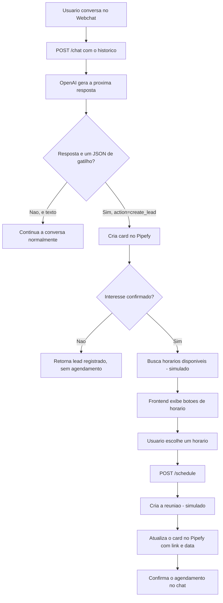

# AI SDR Agent API

Agente SDR (Sales Development Representative) que conversa com um lead via webchat, qualifica esse lead com um LLM, registra os dados no Pipefy e oferece um horário de reunião. Desenvolvido como desafio técnico para a Verzel.

**Status:** MVP completo e deployado — fluxo de conversa, qualificação e CRM real via Pipefy; agendamento no Calendly ainda simulado.

**Aplicação online:**
- Webchat (Vercel): [ai-sdr-agent-api.vercel.app](https://ai-sdr-agent-api.vercel.app/)
- API (Render): [verzel-sdr-backend.onrender.com](https://verzel-sdr-backend.onrender.com/)

O backend está no plano gratuito do Render, então a primeira requisição depois de um tempo parado pode demorar alguns segundos para acordar o serviço.

---

## Problema Resolvido

O primeiro contato de vendas costuma seguir sempre o mesmo roteiro: descobrir nome, e-mail, empresa e a dor do lead, e só depois marcar uma reunião. É repetitivo e consome tempo de um SDR humano antes mesmo de saber se o lead vale a pena.

Este projeto tira essa primeira etapa das mãos de uma pessoa. Um agente conversa com o lead, coleta os quatro dados via linguagem natural, cria automaticamente o card no CRM (Pipefy) e oferece horário de reunião. O SDR humano só entra depois que o lead já está qualificado e agendado.

---

## Como Funciona

O fluxo passa por dois endpoints, `/chat` e `/schedule`, e quem decide quando o lead está qualificado é o próprio modelo de linguagem, não uma regra escrita no backend.



O frontend nunca guarda estado no backend: a cada mensagem, ele reenvia o histórico inteiro da conversa. O `card_id` e os dados do lead que entram em `/schedule` também vêm de volta do próprio frontend, recebidos na resposta anterior do `/chat`.

---

## Arquitetura

- **`backend/main.py`** — camada HTTP. Define os endpoints `/`, `/chat` e `/schedule`, os modelos Pydantic da requisição/resposta, o CORS e a orquestração entre os serviços. Não tem lógica de qualificação própria — só decide o que fazer com o que os serviços devolvem.
- **`backend/services/openai_service.py`** — é onde mora a "personalidade" do agente: um único system prompt que define o papel do SDR, os quatro dados a coletar e o contrato de JSON que o modelo deve devolver quando a qualificação termina.
- **`backend/services/pipefy_service.py`** — cria e atualiza cards no Pipefy via GraphQL puro (sem SDK), usando `requests`.
- **`backend/services/calendar_service.py`** — busca os horários e cria a reunião no Calendly. As chamadas de autenticação (buscar usuário e tipo de evento) são reais; a lista de horários e a criação do evento em si são dados simulados, porque o plano gratuito do Calendly não permite isso via API.
- **`frontend/src/components/ChatWindow.jsx`** — concentra toda a lógica do lado do cliente: histórico da conversa, chamada a `/chat`, exibição dos botões de horário e chamada a `/schedule`.

---

## Integração com LLM

Em vez de programar uma máquina de estados no backend para controlar cada etapa da qualificação (pergunta o nome → pergunta o e-mail → ...), deleguei essa lógica inteira para o modelo através de um único system prompt. O modelo conduz a conversa e, quando já tem os quatro dados e a confirmação de interesse, deve responder **apenas** com um JSON no formato:

```json
{
  "action": "create_lead",
  "data": {
    "name": "...",
    "email": "...",
    "company": "...",
    "need": "...",
    "interest_confirmed": true
  }
}
```

O `main.py` tenta fazer `json.loads()` em toda resposta da IA. Se der certo e vier com `action: create_lead`, trata como gatilho de negócio; se der `JSONDecodeError`, trata como texto normal e a conversa continua.

Essa escolha simplifica bastante o orquestrador, mas transfere para o prompt uma responsabilidade que normalmente seria de código determinístico — se o modelo devolver um JSON num formato levemente diferente do esperado, o gatilho simplesmente não é detectado, sem erro nenhum aparente. Tem mais sobre isso na seção de limitações.

---

## Decisões de Arquitetura

**FastAPI** — pela validação automática via Pydantic e pelo `/docs` interativo, que uso pra testar o fluxo manualmente sem montar um cliente HTTP à parte.

**LLM como controlador do fluxo** — explicado na seção anterior. Prioriza flexibilidade de conversa sobre previsibilidade de máquina de estados.

**Pipefy via GraphQL cru** — só precisava de duas mutations (criar e atualizar card), então montei as queries como string em vez de trazer um SDK inteiro para isso.

**Calendly simulado, mas com autenticação real** — o plano gratuito da API não permite buscar/criar horários programaticamente. Mantive as chamadas reais de `_get_user_url` e `_get_event_type_uri` para validar que as credenciais do Calendly estão corretas, e simulei só a parte que a API gratuita não permite.

**Falha rápida na inicialização** — se `OPENAI_API_KEY` não estiver no `.env`, `openai_service.py` levanta um erro assim que é importado, e a aplicação nem sobe. Preferi isso a deixar o servidor no ar e falhar silenciosamente no meio de uma conversa.

**CORS com lista explícita de origens** — como uso `allow_credentials=True`, não é possível liberar com `"*"`. Listei manualmente `localhost`, `127.0.0.1` e o domínio do Vercel.

---

## Trade-offs

**Estado só existe na conversa, não em banco.** Todo o progresso do lead vive no histórico que o frontend reenvia a cada requisição. Simplifica o backend, mas significa que um refresh de página no meio do fluxo perde a conversa — e o card já criado no Pipefy fica órfão, sem o agendamento.

**`/chat` é síncrono, `/schedule` é assíncrono, e isso muda o comportamento.** `handle_chat` é uma função `def` normal, então o FastAPI a roda automaticamente numa threadpool, mesmo fazendo chamadas bloqueantes (OpenAI, Pipefy) com `requests`. Já `schedule_meeting` é `async def`, mas chama as mesmas funções bloqueantes diretamente — nesse caso, sem o benefício da threadpool, a chamada bloqueia o event loop. É uma inconsistência que só aparece quando se olha os dois endpoints lado a lado.

**Confiar no formato de JSON que o próprio modelo gera.** Funciona na prática na maior parte do tempo, mas é uma dependência de comportamento do modelo, não uma garantia estrutural — ver limitações.

**GraphQL montado com f-string.** Simples de escrever e de ler, mas os valores do lead (nome, e-mail, empresa, necessidade) entram direto na string da mutation, sem escapar aspas.

---

## Estrutura do Projeto

```text
AI-SDR-Agent-API/
├── backend/
│   ├── main.py                    # endpoints /, /chat, /schedule
│   ├── requirements.txt
│   ├── .env.example
│   └── services/
│       ├── openai_service.py       # prompt do agente + chamada a OpenAI
│       ├── pipefy_service.py       # criação/atualização de card via GraphQL
│       └── calendar_service.py     # horários e agendamento (parcialmente simulado)
├── frontend/
│   ├── src/
│   │   ├── App.jsx
│   │   └── components/
│   │       └── ChatWindow.jsx      # UI do chat, chamadas a /chat e /schedule
│   └── package.json
└── docs/
    ├── Verzel_AI_SDR_Agent_Case.md  # estudo de caso do desafio
    └── diagramas e prints (.jpg/.png)
```

---

## Tecnologias

| Tecnologia | Papel no projeto |
|---|---|
| FastAPI | Expõe `/`, `/chat` e `/schedule` |
| OpenAI SDK | Conduz a conversa e emite o gatilho de qualificação |
| Pydantic | Valida os payloads de `/chat` e `/schedule` |
| Requests | Chamadas GraphQL ao Pipefy e REST ao Calendly |
| python-dotenv | Carrega as chaves de API do `.env` |
| React + Vite | Interface do webchat |
| Pipefy | CRM onde o lead qualificado vira um card |
| Calendly | Agendamento de reunião (parcialmente simulado) |
| Render / Vercel | Hospedagem do backend e do frontend, respectivamente |

---

## Como Executar

### Backend

```bash
cd backend
python -m venv venv
source venv/bin/activate          # Windows: venv\Scripts\activate
pip install -r requirements.txt
```

Copie `.env.example` para `.env` e preencha:

```env
OPENAI_API_KEY=sua_chave
OPENAI_MODEL=gpt-4.1-mini
PIPEFY_API_KEY=sua_chave
PIPE_ID=id_do_pipe
PHASE_ID=id_da_fase
PIPEFY_FIELD_NAME=id_do_campo
PIPEFY_FIELD_EMAIL=id_do_campo
PIPEFY_FIELD_COMPANY=id_do_campo
PIPEFY_FIELD_NEED=id_do_campo
PIPEFY_FIELD_INTEREST=id_do_campo
PIPEFY_FIELD_MEETING_LINK=id_do_campo
PIPEFY_FIELD_MEETING_TIME=id_do_campo
CALENDLY_API_KEY=sua_chave
```

Sem `OPENAI_API_KEY`, a aplicação nem sobe (ver decisões de arquitetura).

```bash
uvicorn main:app --reload
```

API em `http://127.0.0.1:8000`, docs em `http://127.0.0.1:8000/docs`.

### Frontend

```bash
cd frontend
npm install
```

A URL do backend está fixa em `src/components/ChatWindow.jsx`, na constante `API_URL` — hoje ela aponta para o backend em produção no Render. Para testar contra o backend local, troque essa linha para `http://127.0.0.1:8000` antes de rodar:

```bash
npm run dev
```

Chat em `http://localhost:5173`.

---

## Como Testar

Não há testes automatizados no repositório. A validação é manual:

**Backend isolado**, via Swagger (`/docs`) ou curl:

```bash
curl -X POST http://127.0.0.1:8000/chat \
  -H "Content-Type: application/json" \
  -d '{"history": [{"role": "user", "content": "Olá"}]}'
```

**Fluxo completo**, com backend e frontend rodando ao mesmo tempo:

1. Abra o webchat e envie uma mensagem inicial.
2. Responda às perguntas do agente (nome, e-mail, empresa, necessidade).
3. Confirme interesse quando o agente perguntar diretamente.
4. Confira no terminal do `uvicorn` se apareceu `GATILHO DETECTADO: 'create_lead'` e se o card foi criado no Pipefy.
5. Escolha um dos horários exibidos no chat.
6. Confira se o card no Pipefy foi atualizado com `meeting_link` e `meeting_datetime`.

---

## Limitações Conhecidas

- O exemplo de JSON dentro do próprio system prompt tem uma chave sem aspas (`interest_confirmed: true`), o que é JSON inválido. Se o modelo reproduzir esse formato literalmente na resposta, o `json.loads()` em `main.py` falha e o gatilho `create_lead` não é detectado — a conversa simplesmente continua como texto normal, sem erro visível.
- `/schedule` é `async def` mas chama funções bloqueantes de `requests` diretamente, travando o event loop sob carga concorrente; `/chat`, por ser `def` normal, não tem esse problema porque o FastAPI a roda em threadpool.
- Os dados do lead entram sem escapar na string da mutation GraphQL do Pipefy — um nome, e-mail ou necessidade com aspas duplas pode quebrar a query.
- Não existe persistência: um refresh de página no meio do fluxo perde a conversa e deixa o card do Pipefy sem agendamento.
- A busca de horários e a criação da reunião no Calendly são simuladas; nenhum convite real é enviado.
- A URL do backend no frontend é uma constante fixa no código-fonte, não uma variável de ambiente — trocar de ambiente exige editar `ChatWindow.jsx` e gerar novo build.
- Sem testes automatizados.
- Sem retry em nenhuma das integrações externas (OpenAI, Pipefy, Calendly).

---

## O que este projeto ainda NÃO faz

- Não persiste leads, conversas ou cards em nenhum banco de dados.
- Não tem autenticação/autorização em nenhum endpoint.
- Não integra de fato com a busca de disponibilidade e criação de eventos do Calendly.
- Não tem observabilidade além dos `print()` no console do backend.
- Não tem rate limiting — qualquer volume de chamadas ao `/chat` gera custo direto de tokens na OpenAI.
- Não tem Docker nem pipeline de CI/CD configurado no repositório.
- Não tem testes automatizados.

O foco desta fase foi validar o fluxo ponta a ponta (conversa → qualificação → CRM → agendamento) e colocá-lo no ar, não deixá-lo pronto para produção.

---

## Próximos Passos

- Corrigir o exemplo de JSON no system prompt (aspas em `interest_confirmed`).
- Escapar os dados do lead antes de interpolar na mutation GraphQL do Pipefy.
- Trocar a URL fixa do frontend por uma variável de ambiente do Vite (`import.meta.env`).
- Persistir o `card_id` e o estado do lead em algo simples (ex.: localStorage ou um banco leve), para sobreviver a um refresh.
- Avaliar alternativas ao Calendly com free tier mais permissivo para agendamento real.
- Escrever testes para os três services, mockando OpenAI, Pipefy e Calendly.

---

## Evolução para Produção

- **Fila** para desacoplar as chamadas a OpenAI, Pipefy e Calendly da resposta HTTP, evitando que o usuário espere três APIs de terceiro em série.
- **Banco de dados (PostgreSQL)** para persistir leads e o status de cada conversa, evitando cards órfãos no Pipefy.
- **Autenticação** nos endpoints, principalmente `/schedule`, hoje aberto para qualquer chamada.
- **Observabilidade** com logs estruturados e métricas de conversão do funil (quantas conversas viram card, quantas viram agendamento).
- **Cliente GraphQL tipado** para o Pipefy, no lugar das mutations em f-string.
- **CI/CD** rodando o lint do frontend (já configurado com ESLint) e os testes do backend a cada push.
- **Rate limiting** no `/chat`, já que cada chamada tem custo direto de tokens.

---

## Aprendizados

A maior dificuldade não foi integrar as três APIs, foi aceitar que o LLM é quem controla o fluxo de negócio. Funciona bem na prática, mas fica evidente o quanto a solução depende do modelo obedecer ao contrato de JSON pedido no prompt — e só percebi, revisando o próprio prompt, que o exemplo que dou ao modelo tem uma chave sem aspas.

Comparar `/chat` (sync) com `/schedule` (async) me ensinou na prática a diferença entre os dois no FastAPI: numa rota sync, o framework me protege rodando em threadpool; numa rota async, se eu não uso um cliente assíncrono de verdade, o bloqueio é problema meu.

Ter que simular parte da integração com o Calendly me ensinou a deixar isso explícito no próprio código — comentário dizendo o que é real e o que é mock — porque é fácil esquecer, meses depois, que aquele link de reunião nunca foi de verdade.

---

## Autor

**Robert Emanuel**

Desenvolvedor Back-end focado em Python, FastAPI, SQL, Docker e APIs REST.

GitHub:
https://github.com/r0b3rTdk

LinkedIn:
https://www.linkedin.com/in/robert-emanuel/