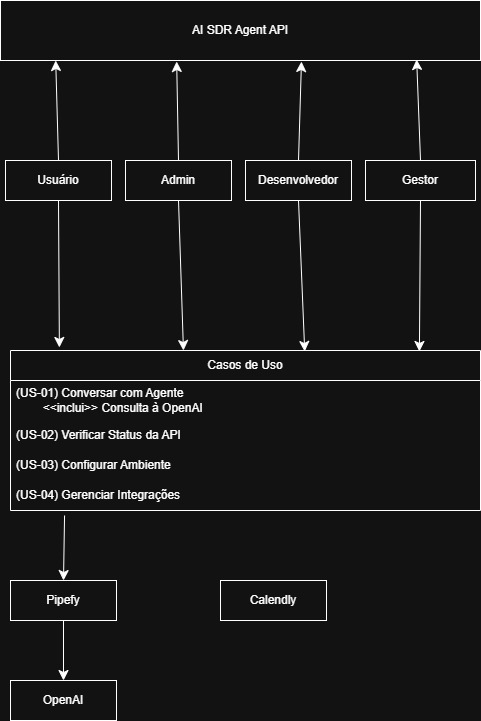
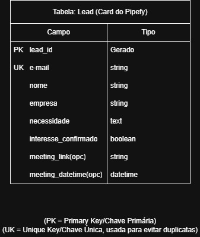
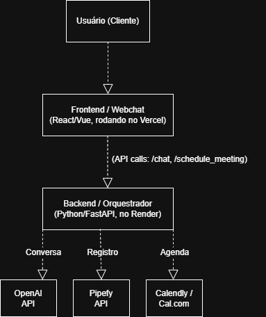
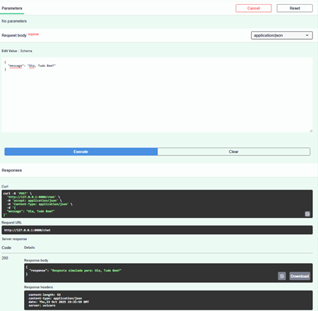
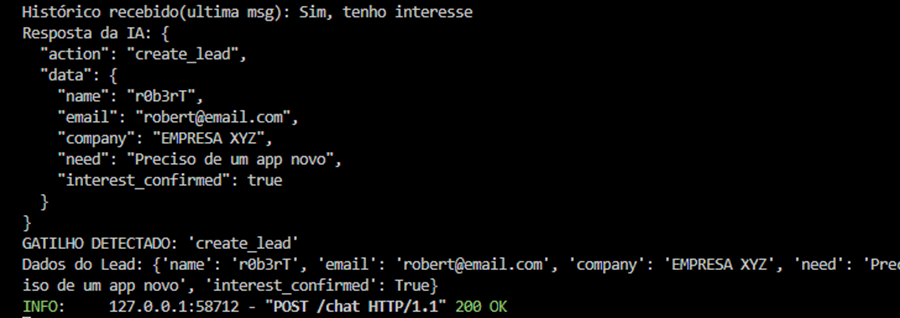
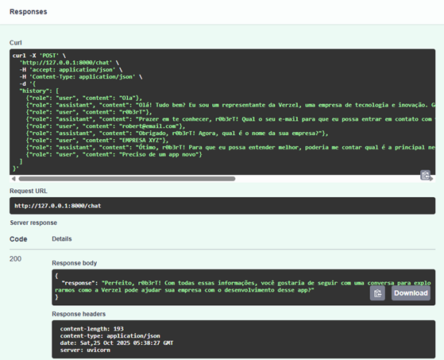
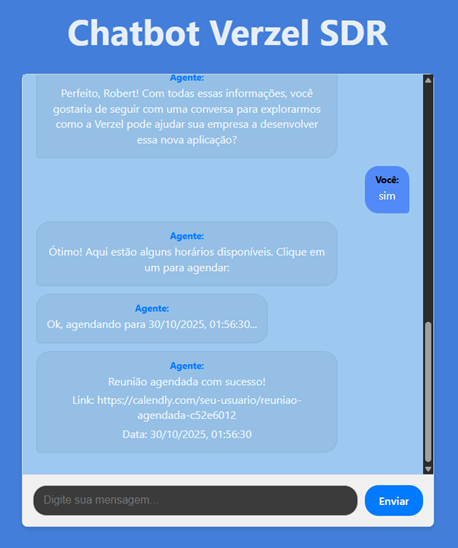

**🤖 Estudo de Caso: Verzel AI SDR Agent API (Versão Final Completa)**

**📁 Introdução**

Este estudo de caso apresenta o desenvolvimento do projeto \*\*Verzel AI
SDR Agent API\*\*,  
um sistema completo de automação de qualificação de leads e agendamento
de reuniões,  
criado como parte do desafio técnico da empresa Verzel.  
O objetivo foi construir um agente SDR (Sales Development
Representative) inteligente,  
capaz de interagir com potenciais clientes, compreender suas
necessidades, registrar informações no Pipefy  
e agendar reuniões no Calendly.  
O projeto foi implementado em arquitetura full-stack, com backend em
FastAPI (Python) e frontend em React (Vite),  
integrando serviços externos como OpenAI API e Pipefy GraphQL.  
Este documento detalha todas as fases do projeto, destacando decisões
técnicas, complexidade computacional,  
metodologias ágeis e indicadores de sucesso (KPIs).

**🏢 Cenário**

A empresa Verzel busca automatizar o início do funil de vendas,  
substituindo o contato manual inicial por um agente virtual
inteligente.  
Esse agente deve qualificar leads com base em perguntas estratégicas,  
registrar os dados no Pipefy e agendar reuniões automaticamente via
Calendly.  
A solução deve ser segura, rápida e escalável.

**📖 Fases do Projeto**

**🔎 Fase 1: Perguntar (Planejamento e Design)**

Tarefas:  
- Definir a pergunta central: como automatizar o funil inicial de vendas
com IA?  
- Levantar requisitos funcionais e não funcionais.  
- Criar User Stories com base no desafio da Verzel.  
- Mapear os fluxos de interação e os atores (Usuário, Agente, Pipefy,
Calendly).  
- Criar os diagramas UML, ERD e Arquitetura do Sistema.  
  
Entregas:  
- Documento de requisitos funcionais.  
- Diagramas UML (Casos de Uso), ERD (Modelo de Dados) e Arquitetura do
Sistema.  
  
Validações:  
- ERD alinhado aos campos do Pipefy.  
- Arquitetura centralizada no FastAPI.

📸 Diagrama UML de Casos de Uso 

📸 Diagrama ERD  

📸 Diagrama de Arquitetura do Sistema

**🧰 Fase 2: Preparar (Configuração do Ambiente Completo)**

Tarefas:  
- Configurar repositório GitHub e .gitignore.  
- Criar estrutura backend/ e frontend/.  
- Configurar venv, instalar dependências (fastapi, uvicorn, openai,
requests, python-dotenv).  
- Criar .env e .env.example.  
- Configurar CORS no backend.  
- Criar README inicial.  
  
Validações:  
- Backend executando com uvicorn.  
- Frontend React + Vite funcionando localmente.  
- Documentação /docs acessível.  
  
📸 Prints do terminal com o servidor rodando e do Swagger UI

**⚙️ Fase 3: Processar (Implementação dos Serviços)**

Tarefas:  
- Implementar openai_service.py (memória e gatilho).  
- Implementar pipefy_service.py (criação e atualização de cards).  
- Implementar calendar_service.py (slots e agendamento). Foram utilizadas simulações para as funções get_available_slots e create_meeting, pois a API gratuita do Calendly pode apresentar restrições para buscar/criar eventos de forma programática, exigindo interações via link de agendamento ou planos pagos para automação completa.  
- Adicionar logs e tratamento de erros.  
  
Validações:  
- Gatilho “create_lead” detectado corretamente.  
- Card criado no Pipefy com sucesso.  
- Slot de reunião retornado corretamente.  
- Logs exibindo sucesso da operação.  
  
📸 Print dos logs do backend confirmando gatilho e criação de card

**🔌 Fase 4: Analisar (Orquestração da API e Fluxo Completo)**

Tarefas:  
- Integrar todos os serviços no main.py.  
- Criar endpoints /chat e /schedule.  
- Validar fluxo completo da conversa até o agendamento.  
  
Validações:  
- JSONs consistentes e padronizados.  
- Fluxo testado no Swagger e no frontend.  
- Respostas corretas e status HTTP 200.  
  
📸 Print do teste completo no Swagger /docs

**📦 Fase 5: Compartilhar (Frontend e Deploy)**

Tarefas:  
- Criar Webchat em React.  
- Implementar chat funcional e exibição de horários.  
- Realizar agendamento via /schedule.  
- Preparar para deploy Render (backend) e Vercel (frontend).  
  
Validações:  
- Interface interativa e responsiva.  
- Comunicação backend \<-\> frontend validada.  
  
📸 Print da mensagem de agendamento bem-sucedido

**🚀 Fase 6: Agir (Entrega Final e Revisão)**

Tarefas:  
- Atualizar README final com links de deploy.  
- Testar sistema completo após deploy.  
- Revisar critérios de sucesso.  
  
Validações:  
- Repositório GitHub completo e funcional.  
- Documentação atualizada.  
- Sistema 100% operacional.

**📋 Backlog Ágil – Verzel AI SDR Agent API**

US-01 – Qualificação de Leads  
Prioridade: Alta \| Estimativa: 5 SP  
Descrição: Permitir que a IA colete nome, e-mail, empresa e
necessidade.  
Critérios de Aceitação: Retornar JSON {"action": "create_lead"} quando a
qualificação for concluída.  
  
US-02 – Integração com Pipefy  
Prioridade: Alta \| Estimativa: 4 SP  
Descrição: Criar card automaticamente ao detectar gatilho da IA.  
Critérios de Aceitação: Card criado com sucesso no funil “Pré-vendas”.  
  
US-03 – Agendamento de Reuniões  
Prioridade: Média \| Estimativa: 3 SP  
Descrição: Exibir horários disponíveis e confirmar reunião.  
Critérios de Aceitação: Retornar JSON {"status": "success"} com link e
data/hora da reunião.  
  
US-04 – Frontend Webchat  
Prioridade: Média \| Estimativa: 4 SP  
Descrição: Exibir histórico, mensagens e botões clicáveis de horários.  
Critérios de Aceitação: Comunicação com backend sem erros de CORS.  
  
US-05 – Deploy Completo  
Prioridade: Baixa \| Estimativa: 2 SP  
Descrição: Publicar backend e frontend em Render e Vercel.  
Critérios de Aceitação: Aplicação acessível publicamente.

### 📐 Análise de Complexidade (Big O)

As principais funções do backend apresentam complexidade **O(1)**, indicando desempenho constante independente do volume de dados.  
A única função linear é a de processamento do histórico do chat, que cresce com o número de mensagens.

| Função                              | Tipo de Operação     | Complexidade | Observação                                         |
|------------------------------------|-----------------------|---------------|----------------------------------------------------|
| `generate_response (OpenAI)`       | I/O externa           | **O(1)**      | Tempo constante por chamada à API                  |
| `create_pipefy_card`               | GraphQL               | **O(1)**      | Tempo constante para criação de card               |
| `get_available_slots`              | I/O simulada          | **O(1)**      | Slots fixos simulados                              |
| `update_pipefy_card_meeting_info`  | GraphQL               | **O(1)**      | Atualização constante                              |
| `handle_chat_flow`                 | Processamento local   | **O(n)**      | Linear em relação ao histórico de mensagens        |

